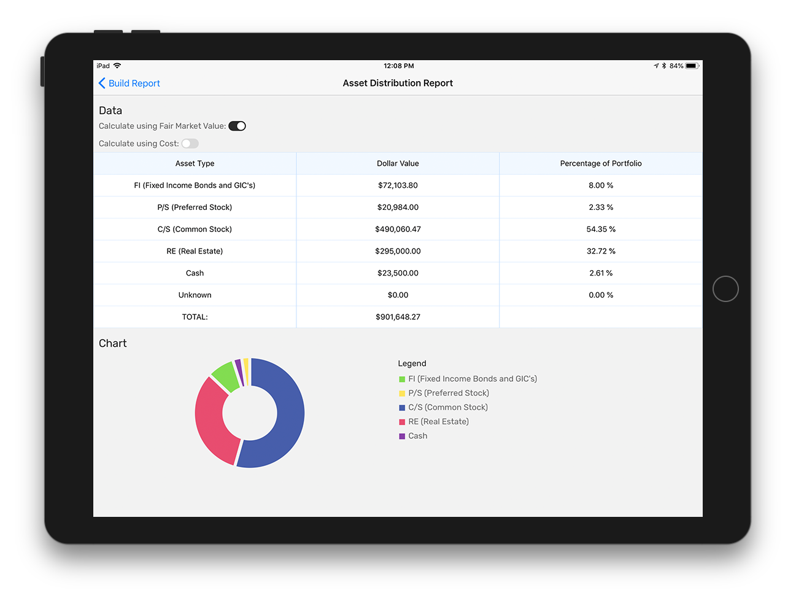

---
# Feel free to add content and custom Front Matter to this file.
# To modify the layout, see https://jekyllrb.com/docs/themes/#overriding-theme-defaults

layout: home
---

A portfolio consolidation tool for iOS.

    

**YourPortfolio (Y$P) gives you a consolidated view of all your investment accounts that you hold across various financial institutions.** This requires you to input your opening positions by account. Once complete, the only updates required are transactions (buy or sell). 

The App enables you to accurately calculate average cost of each investment by account, multiple accounts or all accounts based on your selections. It also provides delayed or end of day historical prices for your common stocks, preferred stocks and mutual funds via third party providers. For other holdings (GIC’s, bonds, real estate, etc.) you have the option to manually enter the current fair market value which can be updated at any time.

To be clear, this app was created to accurately track average cost as opposed to providing real time quotes. This app does not perform transactions, nor will it make investment recommendations.

> _A note on Security and Privacy_: this app does not access any of your financial accounts, or require you to input any of your account passwords. The app’s data is stored on your device with the option to back up the database to Dropbox. At all times, you have complete control over your data.

## Key features

- Create your own accounts with full edit/delete options at the account, security and transaction level
- Flexibility to create your own security Ticker symbols for consistency across accounts
- Overall Account view showing:
	- Income rate
	- Quantity owned
	- Average cost 
	- Total cost
	- Market price (delayed or end of day historical prices, and cached for 24 hours)
	- Total market value
	- Gain/loss

The above data can be viewed by account, or consolidated based on the accounts selected.

## Reporting

1. **Asset Type Distribution**
    - Report on how assets are distributed by type, including the value in each type and percentage of total for the selected accounts. Includes the following asset type categories:
        - FI (fixed income)
        - P/S (preferred stock)
        - C/S (common stock)
        - RE (real estate)
        - Cash
2. **Annual Income Report**
    - Report on how much income your assets are projected to return in a calendar year, organized by asset type.
3. **Maturity Summaries By Year**
    - Report on the dollar amount of your holdings that are going to be maturing in the upcoming 10 years.
4. **Exposure by Issuer**
    - View how your portfolio is diversified across a configurable number of security Issuers.

Reports can be generated by account, or consolidated based on any number of selected accounts.

## What is the purpose of the app?

The purpose of the app is to help the average investor make informed investment decisions based on the composition of their financial portfolio. YourPortfolio accomplishes this by providing a consolidated view of all the user's financial holdings that are held across multiple accounts, and can generate a number of reports to offer deeper insights into this data.

## Who is the target audience?

The target audience of this app is anyone with financial holdings. For example, if you have a retirement fund and a stock trading account, the reports that YourPortfolio generates based on your current holdings can help you make decisions about how to invest additional capital, or how to better balance your existing portfolio across asset types and security issuers.

Additionally, if you have holdings that generate a yield, the app can give you a projection of how much income they are forecasted to return in a year.
